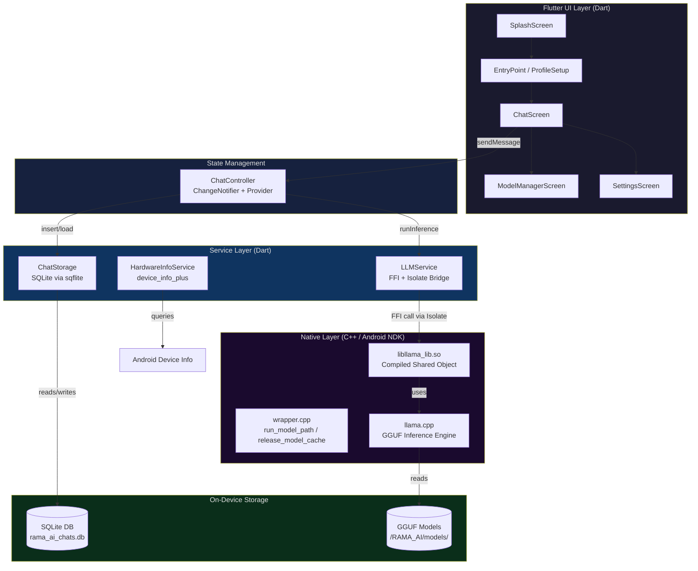
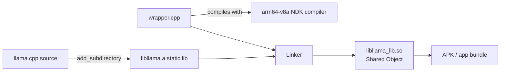
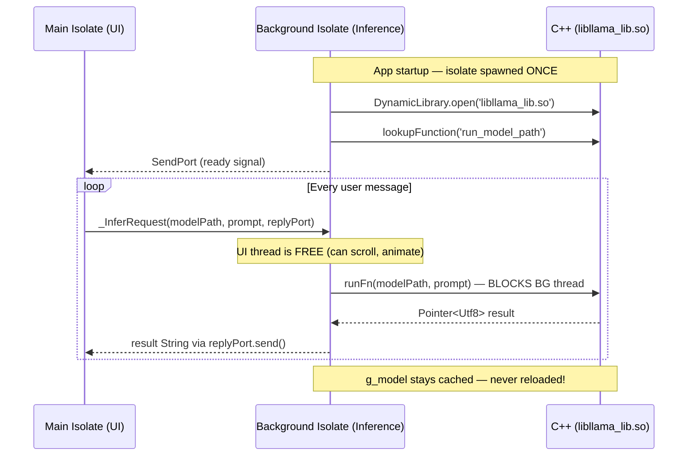
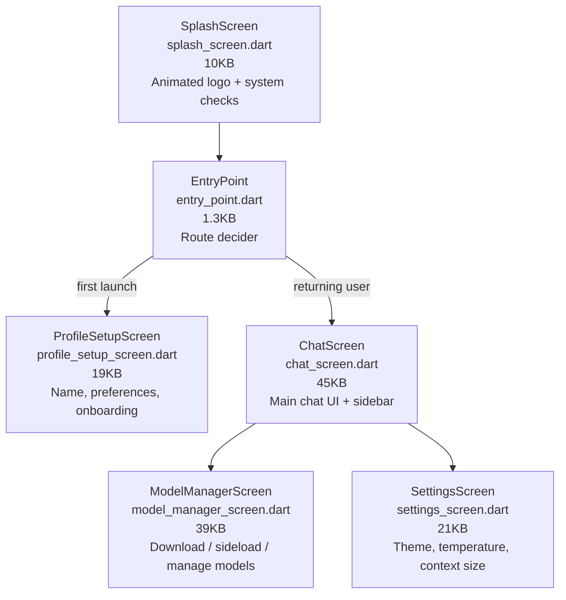
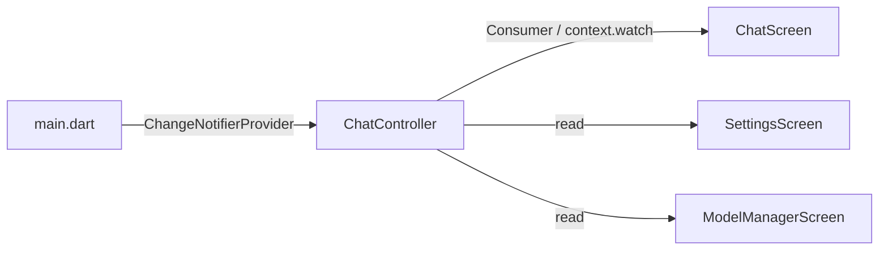
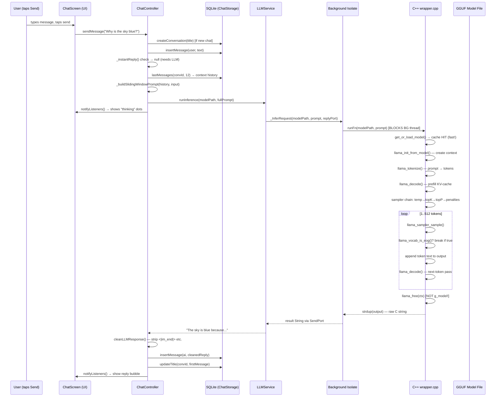

# 📘 RAMA AI — Full Technical Report
### Version 2.0.0 · April 2026 · by Sandeep Muhal

---

## Table of Contents

1. [Project Overview](#1-project-overview)
2. [High-Level Architecture](#2-high-level-architecture)
3. [Technology Stack](#3-technology-stack)
4. [Layer-by-Layer Breakdown](#4-layer-by-layer-breakdown)
   - 4.1 [Native C++ Inference Engine (llama.cpp + wrapper.cpp)](#41-native-c-inference-engine)
   - 4.2 [Android NDK Build Pipeline (CMake)](#42-android-ndk-build-pipeline)
   - 4.3 [Flutter FFI Bridge (LLMService)](#43-flutter-ffi-bridge--llmservice)
   - 4.4 [Dart Isolate Concurrency Strategy](#44-dart-isolate-concurrency-strategy)
   - 4.5 [Sliding-Window Context Algorithm (ChatController)](#45-sliding-window-context-algorithm)
   - 4.6 [Persistence Layer (SQLite via ChatStorage)](#46-persistence-layer--chatstorage)
   - 4.7 [UI Layer (Screens & Widgets)](#47-ui-layer--screens--widgets)
   - 4.8 [State Management (Provider + ChangeNotifier)](#48-state-management)
   - 4.9 [Theme System (AppTheme)](#49-theme-system)
   - 4.10 [Model Management](#410-model-management)
5. [Data Flow: End-to-End Message Lifecycle](#5-data-flow-end-to-end-message-lifecycle)
6. [Inference Pipeline (C++ Deep Dive)](#6-inference-pipeline-c-deep-dive)
7. [Sampler Chain Configuration](#7-sampler-chain-configuration)
8. [Performance Architecture](#8-performance-architecture)
9. [Memory Management Strategy](#9-memory-management-strategy)
10. [SQLite Schema & Database Design](#10-sqlite-schema--database-design)
11. [Directory Structure](#11-directory-structure)
12. [Model Information — Qwen2.5-1.5B-Instruct](#12-model-information)
13. [Key Design Decisions & Tradeoffs](#13-key-design-decisions--tradeoffs)
14. [Future Roadmap Suggestions](#14-future-roadmap-suggestions)

---

## 1. Project Overview

**RAMA AI** is a **100% offline, on-device Large Language Model (LLM) chatbot** built for Android. It runs a quantized version of the **Qwen2.5-1.5B-Instruct** model directly on the mobile device's CPU, without any server, cloud API, or internet connection.

### Core Value Proposition

| Feature | Detail |
|---|---|
| **100% Offline** | All inference runs locally — no network calls |
| **Privacy-First** | Conversations never leave the device |
| **Fast** | 15–20 tokens/second on mid-range Android devices |
| **Lightweight** | ~1 GB model (Q4 quantized) fits in phone storage |
| **Persistent History** | SQLite-backed multi-conversation memory |
| **Swappable Models** | Any `.gguf` model can be loaded at runtime |
| **Premium UI** | Claude-inspired dark/light theme with accent colors |

### Platform Requirements

- **OS:** Android 8.0 (Oreo) API 26+
- **RAM:** ≥ 2 GB
- **Storage:** ≥ 1.5 GB free
- **ABI:** `arm64-v8a` (64-bit ARM — mandatory for llama.cpp)

---

## 2. High-Level Architecture



---

## 3. Technology Stack

| Layer | Technology | Version | Purpose |
|---|---|---|---|
| **UI Framework** | Flutter | SDK ^3.11.4 | Cross-platform mobile UI |
| **Language (UI)** | Dart | 3.x | Application logic |
| **Language (Native)** | C++17 | NDK 28.2 | LLM inference |
| **Inference Engine** | llama.cpp | Latest | GGUF model runner |
| **Build System** | CMake 3.10+ | Android NDK | Native library compilation |
| **FFI Bridge** | dart:ffi + ffi package | ^2.1.0 | Dart ↔ C++ bridge |
| **State Management** | Provider | ^6.1.2 | Reactive UI state |
| **Database** | SQLite (sqflite) | ^2.3.3 | Chat history |
| **Fonts** | Google Fonts (Inter) | ^6.2.1 | Typography |
| **HTTP / Downloads** | Dio | ^5.4.0 | Model downloading |
| **File Picking** | file_picker | ^8.1.2 | Sideload GGUF files |
| **Device Info** | device_info_plus | ^10.1.0 | Hardware diagnostics |
| **Permissions** | permission_handler | ^11.3.1 | Storage access |
| **Model** | Qwen2.5-1.5B-Instruct | Q4_K_M GGUF | ~1 GB LLM weights |

---

## 4. Layer-by-Layer Breakdown

### 4.1 Native C++ Inference Engine

**File:** `android/app/src/main/cpp/wrapper.cpp`

This is the **heart of RAMA AI** — a hand-crafted C++ wrapper that bridges the llama.cpp inference library to the Flutter app via the Android NDK.

#### Key Constants (Tuning Knobs)

```cpp
static constexpr int   K_CTX         = 2048;  // KV-cache context window size
static constexpr int   K_BATCH       = 512;   // Prompt decode chunk size
static constexpr int   K_MAX_GEN     = 512;   // Maximum output tokens
static constexpr int   K_GPU_LAYERS  = 0;     // CPU-only (Vulkan disabled)
static constexpr float K_TEMPERATURE = 0.7f;  // Creativity (0=greedy, 1=creative)
static constexpr int   K_TOP_K       = 40;    // Top-K sampling pool
static constexpr float K_TOP_P       = 0.9f;  // Nucleus sampling threshold
static constexpr float K_REPEAT_PEN  = 1.1f;  // Anti-repetition penalty
```

#### Exported C Functions (the FFI API surface)

```c
// Primary inference function — called from Dart
const char* run_model_path(const char* model_path, const char* prompt);

// Legacy single-argument variant (backward compat)
const char* run_model(const char* prompt);

// Free the cached model from RAM (called on model switch)
void release_model_cache();
```

#### Model Cache Architecture

The **#1 performance optimization** is the persistent model cache:

```cpp
static std::mutex      g_model_mutex;   // Thread-safety guard
static llama_model*    g_model   = nullptr;
static std::string     g_model_path = "";
```

- The model weights (~1 GB) are loaded **exactly once** into RAM on the first message.
- Every subsequent message reuses the cached `g_model` pointer — no disk I/O.
- If the user switches to a different `.gguf` file, `release_model_cache()` frees it first.
- `std::mutex` ensures thread-safety since the persistent Dart isolate calls from a background OS thread.

---

### 4.2 Android NDK Build Pipeline

**File:** `android/app/src/main/cpp/CMakeLists.txt`

```cmake
cmake_minimum_required(VERSION 3.10)
project(rama_ai)
set(CMAKE_CXX_STANDARD 17)

add_subdirectory(llama.cpp)   # Build llama.cpp as a static library

add_library(llama_lib SHARED wrapper.cpp)   # Our JNI wrapper → .so

target_include_directories(llama_lib PRIVATE
    ${CMAKE_CURRENT_SOURCE_DIR}/llama.cpp/include
)

target_link_libraries(llama_lib
    llama     # llama.cpp static lib
    log       # Android logcat
)
```

**Build flow:**



**ABI Filter** — `build.gradle.kts` restricts to `arm64-v8a` only:
```kotlin
ndk {
    abiFilters += listOf("arm64-v8a")
}
```
This keeps APK size small and ensures compatibility with all modern Android phones (2017+).

---

### 4.3 Flutter FFI Bridge — LLMService

**File:** `lib/services/llm_service.dart`

This Dart class is the **glue** between the Flutter world and the native C++ library.

#### FFI Type Definitions

```dart
// Maps to: const char* run_model_path(const char*, const char*)
typedef _RunModelNative  = Pointer<Utf8> Function(Pointer<Utf8>, Pointer<Utf8>);
typedef _RunModelDart    = Pointer<Utf8> Function(Pointer<Utf8>, Pointer<Utf8>);

// Maps to: void release_model_cache()
typedef _ReleaseCacheNative = Void Function();
typedef _ReleaseCacheDart   = void Function();
```

#### Library Loading

```dart
final lib     = DynamicLibrary.open('libllama_lib.so');
runFn         = lib.lookupFunction<_RunModelNative, _RunModelDart>('run_model_path');
releaseFn     = lib.lookupFunction<_ReleaseCacheNative, _ReleaseCacheDart>('release_model_cache');
```

The `.so` is opened by name — Android's dynamic linker finds it in the APK's `lib/arm64-v8a/` directory automatically.

#### Inference Call

```dart
final mpPtr     = msg.modelPath.toNativeUtf8();   // Dart String → C char*
final pPtr      = msg.prompt.toNativeUtf8();
final resultPtr = runFn(mpPtr, pPtr);              // BLOCKING FFI call
result          = resultPtr.toDartString();         // C char* → Dart String
malloc.free(mpPtr);
malloc.free(pPtr);
```

The FFI boundary handles encoding: Dart Strings (UTF-16) are transcoded to UTF-8 native pointers before crossing the boundary.

---

### 4.4 Dart Isolate Concurrency Strategy

This is one of RAMA AI's most sophisticated architectural decisions.

#### Why a Persistent Background Isolate?

```
PROBLEM 1: FFI blocks the calling thread
  → If called from the main isolate, the UI freezes
  → Android detects this as ANR (Application Not Responding)
  → OS kills the app after 5 seconds

PROBLEM 2: Short-lived isolates (Isolate.run()) destroy C++ state
  → Each new isolate loads a fresh copy of libllama_lib.so
  → g_model cache is LOST between calls
  → Full model reload (2–18 seconds) on EVERY message
```

#### Solution: Single Long-Lived Background Isolate



#### Isolate Message Types

Only plain Dart objects cross isolate boundaries (no native pointers):

```dart
class _InferRequest {
  final String   modelPath;
  final String   prompt;
  final SendPort replyTo;    // Where to send the answer back
}

class _ReleaseRequest { }    // Signal to free g_model
```

#### Busy Guard

```dart
static bool _busy = false;

if (_busy) return 'Error: Inference already in progress. Please wait.';
_busy = true;
try {
  // ... inference ...
} finally {
  _busy = false;  // Always released even on exception
}
```

---

### 4.5 Sliding-Window Context Algorithm

**File:** `lib/core/chat_controller.dart`

This algorithm prevents the LLM from running out of context window space during long conversations — a critical stability feature.

#### The Problem

LLMs have a fixed **context window** (RAMA AI: 2048 tokens). As conversations grow:
- Naively, you'd send ALL history → prompt exceeds context → crash / garbled output
- The model can't "remember" everything in a 30-message conversation

#### The Solution: Rolling Window

```
static const int _maxContextMessages = 12;  // Last 12 messages (~6 turns)
```

```dart
final contextMsgs = await ChatStorage.lastMessages(
  currentConvId!, _maxContextMessages,  // Fetch only the last 12 from DB
);
final prompt = _buildSlidingWindowPrompt(contextMsgs, text.trim());
```

#### Prompt Structure

```
[SYSTEM INSTRUCTION]
You are RAMA, a helpful, accurate, and concise AI assistant.
Give complete, well-structured answers.

[OPTIONAL USER PREFERENCES]
User preferences: <customInstructions>

[CONTEXT WINDOW — last 12 messages]
User: <message 1>
Assistant: <reply 1>
User: <message 2>
Assistant: <reply 2>
... (up to 12 messages)

[CURRENT TURN]
User: <current input>
Assistant:          ← model continues from here
```

#### Window Sliding Visualization

```
Conv: [M1][M2][M3][M4][M5][M6][M7][M8][M9][M10][M11][M12][M13] ← new message
       ↑ dropped                                        ↑────────────────────────
                    Window: [M2]...[M13] = 12 messages sent to model
```

#### Instant Reply System

For simple social greetings, RAMA responds **instantly** (~0ms) without invoking the LLM:

```dart
static final _kPresetReplies = <RegExp, List<String>>{
  RegExp(r'^h+e+l+o+[!?.]*$'): ['Hey there! 👋 ...', 'Hello! 😊 ...'],
  RegExp(r'^h+i+[!?.]*$'):     ['Hi! 👋 How can I help?', ...],
  RegExp(r'^who\s+are\s+you'): ['I\'m RAMA — your offline AI! 🤖 ...'],
  // ... more patterns
};
```

This gives the perception of instant responses for conversational openers.

---

### 4.6 Persistence Layer — ChatStorage

**File:** `lib/storage/chat_storage.dart`

Uses `sqflite` (a Flutter SQLite wrapper) to persist all conversations and messages locally.

#### Database Location

```dart
final dbPath = await getDatabasesPath();          // Android app-private DB dir
final path   = p.join(dbPath, 'rama_ai_chats.db');
```

#### Data Models

```dart
class Conversation {
  int?     id;         // SQLite AUTOINCREMENT PK
  String   title;      // Auto-derived from first message
  DateTime createdAt;
  DateTime updatedAt;  // Updated on every new message
}

class StoredMessage {
  int?     id;
  int      conversationId;  // FK → conversations.id
  String   role;            // 'user' | 'ai' | 'error'
  String   text;
  DateTime time;
}
```

#### Key Operations

| Method | SQL | Purpose |
|---|---|---|
| `createConversation()` | `INSERT INTO conversations` | New chat session |
| `listConversations()` | `SELECT ... ORDER BY updated_at DESC` | History sidebar |
| `insertMessage()` | `INSERT INTO messages` | Persist each turn |
| `lastMessages(id, n)` | `SELECT ... ORDER BY time DESC LIMIT n` | Sliding window |
| `loadMessages(id)` | `SELECT ... ORDER BY time ASC` | Full chat reload |
| `deleteConversation(id)` | `DELETE FROM conversations WHERE id=?` | Cascades to messages |
| `updateTitle(id, title)` | `UPDATE conversations SET title=?` | Auto-title from first msg |

---

### 4.7 UI Layer — Screens & Widgets

The app has **6 screens**:



#### ChatScreen (45 KB — Most Complex)

The main screen contains:
- **Sidebar Drawer** — Grouped conversation history (Today / Last 7 Days / Older)
- **Message List** — Scrollable chat bubbles with role-differentiated styling
- **Thinking Indicator** — Animated dots while inference runs
- **Input Bar** — TextField + Send button
- **AppBar** — Model name, hamburger menu, new chat button

---

### 4.8 State Management

**File:** `lib/core/chat_controller.dart`

RAMA AI uses the **Provider + ChangeNotifier** pattern — Flutter's recommended approach for medium-complexity state.



#### State Variables in ChatController

```dart
// Chat state
List<ChatMessage>    messages       = [];     // Current session messages
List<Conversation>   conversations  = [];     // Sidebar list
int?                 currentConvId;           // Active session ID
bool                 isThinking     = false;  // Inference in-progress flag
bool                 historyLoading = false;  // Sidebar loading flag
String?              activeModelPath;         // Selected .gguf path

// Settings state
String  customInstructions = '';    // User-defined system prompt addition
double  temperature        = 0.7;   // LLM temperature
int     maxTokens          = 512;   // Max output tokens
int     contextWindowSize  = 2048;  // KV context size
```

All state mutations call `notifyListeners()` which triggers Flutter to rebuild only the widgets that depend on the changed state.

---

### 4.9 Theme System

**File:** `lib/core/app_theme.dart`

A fully custom theming system inspired by Claude AI's design language.

#### Accent Color Presets

```
Preset 0: #DA7756  — Claude Orange/Peach (default)
Preset 1: #7C6EF5  — Indigo
Preset 2: #3B82F6  — Blue
Preset 3: #06B6D4  — Cyan
Preset 4: #10B981  — Emerald
Preset 5: #F59E0B  — Amber
Preset 6: #EC4899  — Pink
Preset 7: #8B5CF6  — Violet
```

#### Dark Palette (Claude-inspired)

```
Background     #121212  — Deep dark
Surface        #1A1A1A  — Slightly lighter
Card           #1E1E1E  — Card backgrounds
Elevated       #242424  — Raised elements
Border         #2A2A2A  — Dividers
Text           #E0E0E0  — Primary text
Text Sub       #8A8A8A  — Secondary text
```

#### Light Palette

```
Background     #F8F7F5  — Warm off-white (Claude-like)
Surface        #FFFFFF  — Cards and sheets
Border         #E0DDD8  — Subtle separators
Text           #1A1A1A  — Near-black
```

#### AppTheme as ChangeNotifier

`AppTheme` extends `ChangeNotifier` so that theme changes (dark/light toggle, accent switch) trigger a **full app rebuild** without requiring hot-restart:

```dart
void toggle() {
    _isDark = !_isDark;
    notifyListeners();   // Causes MaterialApp to rebuild with new ThemeData
}
```

#### Typography

All text uses **Google Fonts — Inter** for a premium, modern sans-serif look across all text sizes.

---

### 4.10 Model Management

**File:** `lib/screens/model_manager_screen.dart`

The Model Manager screen provides:

1. **Download Models** — Uses `Dio` to download `.gguf` files from HuggingFace URLs with real-time progress tracking
2. **Sideload Models** — Uses `file_picker` to copy a manually placed `.gguf` from any storage location
3. **Storage Location** — Models stored at `<external-storage>/RAMA_AI/models/*.gguf`
4. **Active Model Selection** — Sets `ChatController.activeModelPath` via Provider
5. **Model Switching** — Calls `LLMService.releaseModelCache()` before switching to free the old model from RAM

```dart
// LLMService model directory resolution
static Future<Directory> get modelsDir async {
    final base = await getExternalStorageDirectory()
        ?? await getApplicationDocumentsDirectory();   // Fallback
    final dir = Directory('${base.path}/RAMA_AI/models');
    if (!dir.existsSync()) dir.createSync(recursive: true);
    return dir;
}
```

---

## 5. Data Flow: End-to-End Message Lifecycle



---

## 6. Inference Pipeline (C++ Deep Dive)

The `run_model_path()` function executes these 7 stages:

### Stage 1: Backend Init
```cpp
llama_backend_init();   // Idempotent — safe to call every time
```
Initializes llama.cpp's internal state (BLAS threads, etc.).

### Stage 2: Model Loading (Cached)
```cpp
llama_model* model = get_or_load_model(model_path);
```
- **Cache HIT:** Returns `g_model` pointer in <1ms
- **Cache MISS:** Reads GGUF from disk, maps weights into RAM (~2–10 seconds first time)
- Protected by `std::mutex` for thread safety

### Stage 3: Context Creation
```cpp
llama_context_params cp = llama_context_default_params();
cp.n_ctx = 2048;            // KV-cache size
cp.n_batch = 512;           // Decode chunk
cp.n_threads = hardware_concurrency();   // Auto-detect CPU cores
cp.n_threads_batch = cp.n_threads;

llama_context* ctx = llama_init_from_model(model, cp);
```
The context holds the **KV-cache** (key-value attention cache) for one inference pass. It's lightweight (~few MB) and created fresh each call.

### Stage 4: Tokenization
```cpp
// Two-pass tokenization (measure then fill)
int n_tokens = llama_tokenize(vocab, prompt, len, nullptr, 0, true, false);
std::vector<llama_token> tokens(n_tokens);
llama_tokenize(vocab, prompt, len, tokens.data(), n_tokens, true, false);
```
Converts the text prompt into the model's integer token IDs.

**Guard:** If tokens ≥ 2044 (context - 4), returns an error asking user to shorten.

### Stage 5: Prefill (Prompt Processing)
```cpp
llama_batch batch = llama_batch_init(n_tokens, 0, 1);
// Fill batch with all prompt tokens
// Only last token has logits=true (we only need the prediction after the prompt)
llama_decode(ctx, batch);   // Fills KV-cache for entire prompt
```
The entire prompt is processed in one batch decode, populating the KV-cache. This is the "reading" phase.

### Stage 6: Autoregressive Generation Loop
```cpp
for (int i = 0; i < K_MAX_GEN; i++) {      // Up to 512 tokens
    llama_token tok = llama_sampler_sample(sampler, ctx, -1);
    
    if (llama_vocab_is_eog(vocab, tok)) break;   // End-of-generation check
    
    // Token → text piece
    char buf[256];
    llama_token_to_piece(vocab, tok, buf, sizeof(buf)-1, 0, true);
    output.append(buf);
    
    // Feed back for next step
    llama_batch nb = llama_batch_get_one(&tok, 1);
    llama_decode(ctx, nb);   // One-token decode to get next logits
}
```

### Stage 7: Cleanup
```cpp
llama_sampler_free(sampler);
llama_free(ctx);         // ← Context freed (lightweight)
// g_model NOT freed — stays cached for next call!
return strdup(output.c_str());   // Caller must eventually free
```

---

## 7. Sampler Chain Configuration

The sampler chain controls **how the next token is chosen** from the model's probability distribution. RAMA AI uses a 5-stage chain:

```
Raw logits (vocabulary-size float array)
          ↓
[1] Temperature (0.7)
    Scales probability distribution
    0.0 = deterministic (always pick highest prob)
    1.0 = very diverse (sample broadly)
    0.7 = balanced creativity
          ↓
[2] Top-K (40)
    Keep only the 40 highest-probability tokens
    Discards long tail of unlikely words
          ↓
[3] Top-P / Nucleus (0.9)
    Keep tokens until cumulative probability ≥ 90%
    Dynamically adjusts pool size per token
          ↓
[4] Repetition Penalty (1.1×)
    Divide probability of recently-seen tokens by 1.1
    Prevents the model from looping ("the the the...")
          ↓
[5] Greedy Pick
    Select the highest-probability token from remaining
          ↓
    Final token ID selected
```

This chain produces **coherent, non-repetitive, natural-sounding** text with good quality/speed balance.

---

## 8. Performance Architecture

### Key Performance Decisions

| Decision | Before | After | Impact |
|---|---|---|---|
| Persistent background isolate | New isolate per message | Single long-lived isolate | Eliminates 2–18s model reload lag |
| Model cache (g_model) | Load/free every message | Load once, cache forever | Near-zero first-token latency after warmup |
| Context per call (not cached) | N/A | Fresh context each call | Correct per-message KV state |
| Multi-thread inference | 1 thread | All CPU cores auto-detected | 2–4× speed improvement |
| Parallel batch processing | N/A | `n_threads_batch = n_threads` | Faster prompt prefill |
| Sliding window (12 msgs) | Full history | Last 12 messages only | Prevents context overflow |
| Instant replies for greetings | LLM call | Regex match → instant | 0ms for "hi", "hello", etc. |

### Token Throughput

- **Target:** 15–20 tokens/second on mid-range Android
- **Bottleneck:** CPU matrix multiplication (llama.cpp is highly optimized ARM NEON)
- **Scaling:** Performance scales with CPU core count due to `n_threads = hardware_concurrency()`

---

## 9. Memory Management Strategy

```
┌─────────────────────────────────────────────────────┐
│  Android RAM                                        │
│                                                     │
│  ┌──────────────┐   ┌─────────────────────────────┐ │
│  │  Flutter     │   │  Native Heap (C++)           │ │
│  │  Main        │   │                              │ │
│  │  Isolate     │   │  g_model (~1 GB)  ← CACHED   │ │
│  │  (UI)        │   │  g_model_path     ← tracked  │ │
│  │              │   │  g_model_mutex    ← safety   │ │
│  │  Background  │   │                              │ │
│  │  Isolate     │   │  ctx (~few MB)    ← per call │ │
│  │  (Inference) │   │  tokens[]         ← per call │ │
│  │              │   │  output buffer    ← per call │ │
│  └──────────────┘   └─────────────────────────────┘ │
│                                                     │
│  SQLite DB: ~few MB (conversation history)          │
└─────────────────────────────────────────────────────┘
```

- **Model (~1 GB):** Loaded once, never released unless user switches models
- **Context (~few MB):** Created and freed per-call (`llama_free(ctx)`)
- **Token buffer:** Stack-allocated vector, freed at end of function
- **C strings returned:** `strdup()`'d — Dart side calls `toDartString()` then the pointer is freed by `malloc.free()`

---

## 10. SQLite Schema & Database Design

```sql
-- Database: rama_ai_chats.db

CREATE TABLE conversations (
    id         INTEGER PRIMARY KEY AUTOINCREMENT,
    title      TEXT    NOT NULL,          -- Auto-derived from first message
    created_at INTEGER NOT NULL,          -- Unix ms since epoch
    updated_at INTEGER NOT NULL           -- Bumped on every new message
);

CREATE TABLE messages (
    id              INTEGER PRIMARY KEY AUTOINCREMENT,
    conversation_id INTEGER NOT NULL,
    role            TEXT    NOT NULL,     -- 'user' | 'ai' | 'error'
    text            TEXT    NOT NULL,
    time            INTEGER NOT NULL,     -- Unix ms since epoch
    FOREIGN KEY (conversation_id) 
        REFERENCES conversations(id) 
        ON DELETE CASCADE               -- Deleting a chat deletes all messages
);
```

### Querying for Sidebar (History Grouping)

Conversations are sorted by `updated_at DESC` then grouped in Dart:

```dart
Map<String, List<Conversation>> groupedConversations() {
    // Groups: 'Today', 'Previous 7 Days', 'Older'
    final diff = now.difference(c.updatedAt).inDays;
    // diff == 0 → Today
    // diff <= 7 → Previous 7 Days
    // else → Older
}
```

---

## 11. Directory Structure

```
RAMA-APP/
└── rama_ai/                          ← Flutter project root
    ├── pubspec.yaml                  ← Dependencies + icons config
    ├── lib/
    │   ├── main.dart                 ← App entry (Provider setup, theme init)
    │   ├── core/
    │   │   ├── app_theme.dart        ← Theme system, color tokens, AppTheme
    │   │   └── chat_controller.dart  ← State machine (ChangeNotifier)
    │   ├── screens/
    │   │   ├── splash_screen.dart    ← Animated entry screen
    │   │   ├── entry_point.dart      ← Routing logic
    │   │   ├── profile_setup_screen.dart ← Onboarding
    │   │   ├── chat_screen.dart      ← Main chat UI (45 KB)
    │   │   ├── model_manager_screen.dart ← Download/manage GGUFs (39 KB)
    │   │   └── settings_screen.dart  ← Preferences (21 KB)
    │   ├── services/
    │   │   ├── llm_service.dart      ← FFI bridge + isolate management
    │   │   └── hardware_info.dart    ← Device info queries
    │   ├── storage/
    │   │   └── chat_storage.dart     ← SQLite CRUD operations
    │   ├── models/
    │   │   └── chat_message.dart     ← ChatMessage data class
    │   ├── utils/
    │   │   └── response_cleaner.dart ← Strip LLM format tokens
    │   └── widgets/
    │       └── shared_widgets.dart   ← Reusable UI components (24 KB)
    ├── android/
    │   └── app/
    │       ├── build.gradle.kts      ← NDK config, ABI filter, CMake path
    │       └── src/main/
    │           ├── AndroidManifest.xml
    │           └── cpp/
    │               ├── CMakeLists.txt  ← Native build script
    │               ├── wrapper.cpp     ← llama.cpp JNI/FFI bridge
    │               └── llama.cpp/      ← llama.cpp library source
    └── assets/
        └── icon/app_icon.png         ← App launcher icon
```

---

## 12. Model Information

### Qwen2.5-1.5B-Instruct (Default Model)

| Property | Value |
|---|---|
| **Full Name** | Qwen2.5-1.5B-Instruct-GGUF |
| **Developer** | Alibaba Cloud (Qwen Team) |
| **Parameters** | 1.5 Billion |
| **Quantization** | Q4_K_M (4-bit, medium quality) |
| **File Size** | ~1 GB |
| **Format** | GGUF (llama.cpp compatible) |
| **License** | Apache 2.0 |
| **Context Length** | 32,768 tokens (model max) |
| **RAMA context** | 2,048 tokens (config limit) |
| **Performance (mid-range)** | 15–20 tokens/second |
| **Architecture** | Transformer, GQA attention |
| **Instruction Format** | ChatML (`<|im_start|>`, `<|im_end|>`) |

### Why Qwen2.5-1.5B?

- Small enough for 2 GB RAM devices
- Strong multilingual support (Hindi, English, etc.)
- Apache 2.0 license (free commercial use)
- Excellent instruction-following at this parameter count

### Other Supported Models

Any `.gguf` compatible model can be sideloaded, including:
- Llama 3.2 1B / 3B
- Gemma 2B
- Phi-3 Mini
- Mistral 7B (requires 4+ GB RAM)
- SmolLM 135M / 360M (very fast)

---

## 13. Key Design Decisions & Tradeoffs

### ✅ Decision 1: Persistent Isolate vs. `Isolate.run()`

| | `Isolate.run()` | Persistent Isolate (chosen) |
|---|---|---|
| Model load | Every call | Once |
| First-token latency | 2–18 seconds | ~0ms (after warmup) |
| Complexity | Low | Medium |
| Memory | Fresh on each call | Stays in RAM |
| **Verdict** | ❌ Too slow | ✅ Production-ready |

### ✅ Decision 2: CPU-Only Inference (K_GPU_LAYERS = 0)

Vulkan GPU acceleration is technically supported by llama.cpp on Android, but:
- Vulkan driver quality varies wildly across Android OEMs
- Some devices crash or produce wrong outputs with Vulkan
- CPU inference with all cores is fast enough (15–20 tok/s) for the 1.5B model
- Safe default; can be raised for tested devices

### ✅ Decision 3: Context per call, Model cached

Creating a fresh `llama_context` per message (instead of keeping it persistent):
- **Pro:** Correct KV-cache state for each call's specific prompt
- **Pro:** Avoids KV-cache poisoning from previous turns
- **Pro:** Very cheap (~few MB, ~1ms creation time)
- **Con:** Slight overhead; but negligible vs. model weight loading

### ✅ Decision 4: SQLite over Hive/SharedPreferences

For multi-conversation chat history with cascading deletes, relational queries, and N-message window queries — SQLite is the correct choice. Hive (NoSQL) would require manual implementation of all query logic.

### ✅ Decision 5: Provider over Bloc/Riverpod

For this app's complexity level, Provider + ChangeNotifier is the minimal viable architecture that avoids over-engineering. The app has one central state object (ChatController) that multiple screens read from.

---

## 14. Future Roadmap Suggestions

| Feature | Priority | Notes |
|---|---|---|
| **Streaming output** | 🔴 High | Show tokens as they're generated (requires stream-based FFI) |
| **Vulkan GPU toggle** | 🟡 Medium | Runtime setting for capable devices |
| **System prompt editor** | 🟡 Medium | Per-conversation custom instructions |
| **Model quantization info** | 🟡 Medium | Show Q4/Q8 metadata from GGUF header |
| **Voice input (STT)** | 🟡 Medium | Whisper.cpp integration |
| **Markdown rendering** | 🟡 Medium | Render code blocks, bold, lists in chat |
| **Export conversations** | 🟢 Low | Export as .txt or .md |
| **Background download** | 🟢 Low | Continue model download with screen off |
| **Multiple simultaneous models** | 🔴 Hard | RAM constraints make this challenging |
| **LoRA adapter support** | 🔴 Hard | llama.cpp supports it; needs UI |

---

*Report generated: April 17, 2026*
*RAMA AI v2.0.0+4 — Developed by Sandeep Muhal*
*Tech Stack: Flutter + Dart + C++17 + llama.cpp + Android NDK 28.2*
